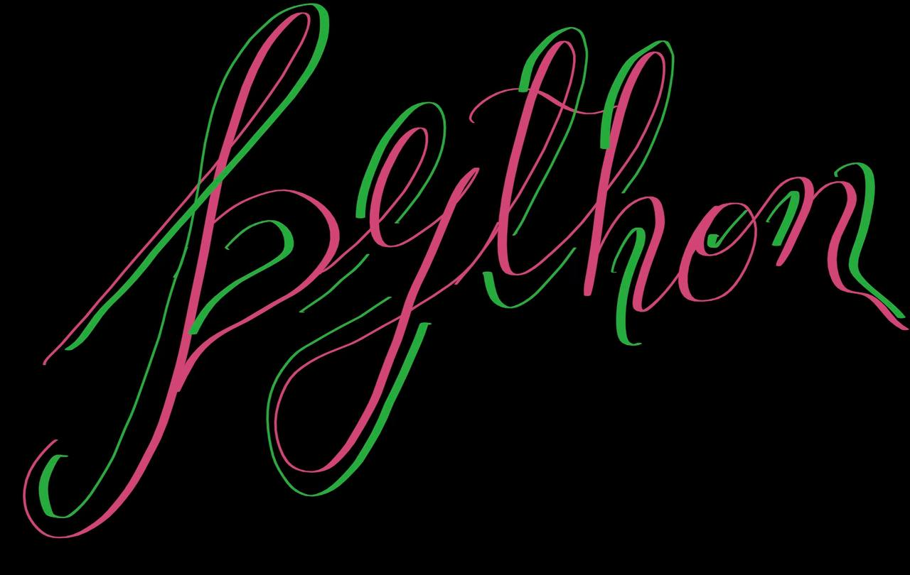

---

    

---

# Python codes for 💻Binary Coders community (🔒private community)

We encourage contributions to this repository. If you come across any issues or have ideas for improvements, please don't hesitate to open a pull request. Your input is highly appreciated!

### Contribution rules
- Please ensure that your code follows proper alignments and conventions for enhanced readability.

---

### Authors

<table>
<tr>
    <td align="center">
        <a href="https://github.com/AvikAgarwala">
            
             
            <b>Avik Agarwala</b>
        </a>
    </td>
    <td align="center">
        <a href="https://github.com/Alik-Agarwala">
            
             
            <b>Alik Agarwala</b>
        </a>
    </td></tr>
</table>

### Contributors

<!-- readme: contributors -start -->
<table>
<tr>
    <td align="center">
        <a href="https://github.com/AvikAgarwala">
            
             
            <b>Avik Agarwala</b>
        </a>
    </td>
    <td align="center">
        <a href="https://github.com/Alik-Agarwala">
            
             
            <b>Alik Agarwala</b>
        </a>
    </td>
    <td align="center">
        <a href="https://github.com/SomnathSengupta">
            
             
            <b>Somnath Sengupta</b>
        </a>
    </td>
    <td align="center">
        <a href="https://github.com/SohomGhosh10">
            
             
            <b>Sohom Ghosh</b>
        </a>
    </td>
    <td align="center">
        <a href="https://github.com/Priyam123dutta">
            
             
            <b>Priyam Dutta</b>
        </a>
    </td>
    <td align="center">
        <a href="https://github.com/Arghadeeps07">
            
             
            <b>ARGHADEEP SARKAR</b>
        </a>
    </td></tr>
<tr>
    <td align="center">
        <a href="https://github.com/Arundhuti2004">
            
             
            <b>ARUNDHUTI SARKAR</b>
        </a>
    </td>
    <td align="center">
        <a href="https://github.com/sudiptamazumdar">
            
             
            <b>Sudipta Mazumdar</b>
        </a>
    </td></tr>
</table>
<!-- readme: contributors -end -->

---
